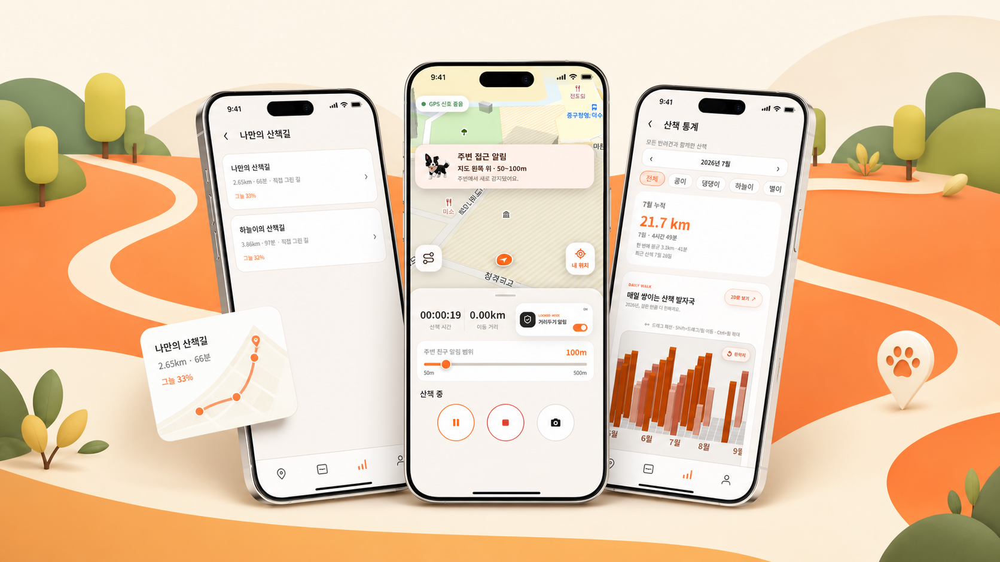
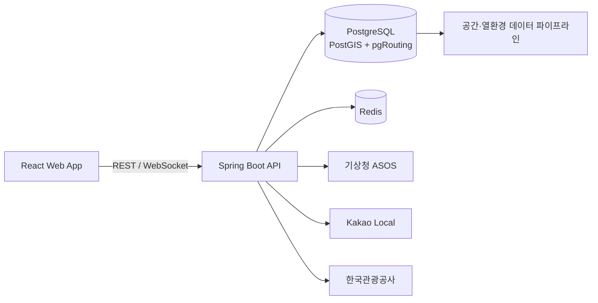

<div align="center">
  

  <h3>오늘의 시간과 환경에 맞춰, 반려견과 더 안전하게 걷는 길</h3>

  <p>
    목표 시간 기반 코스 추천부터 그늘·추정 노면온도 비교,<br />
    실시간 산책 기록과 조우 제어까지 연결한 반려견 산책 서비스입니다.
  </p>

  <p>
    
    
    
    
    
  </p>
</div>



## 멍루트 소개

기존 산책 서비스가 목적지나 인기 코스를 먼저 묻는다면, 멍루트는 **보호자가 오늘 걸을 수 있는 시간**에서 시작합니다. 사용자의 대표 코스를 기준으로 시간에 맞는 순환 코스를 만들고, 시간대별 그늘과 추정 노면온도를 함께 보여줘 보호자가 추천 근거를 직접 비교할 수 있도록 합니다.

산책 중에는 경로 안내와 주변 반려견 조우 제어를 제공하고, 산책이 끝나면 실제 이동 경로를 저장해 기록·통계·다음 추천으로 연결합니다.

## 주요 기능

| 기능 | 설명 |
| --- | --- |
| 목표 시간 기반 추천 | 산책 가능 시간을 기준으로 대표 코스와 대안 코스를 생성하고 비교합니다. |
| 그늘·노면온도 진단 | 시간대별 그늘 비율, 추정 노면온도, 변경 구간과 추천 근거를 제공합니다. |
| 나의 코스 관리 | 직접 그린 길과 저장한 산책을 관리하고 대표 코스를 지정합니다. |
| 실시간 산책 기록 | GPS 경로, 거리, 시간, 일시정지와 맵매칭 결과를 저장합니다. |
| 조우 제어 | 거리두기 모드와 만나기 모드로 주변 반려견과의 접근 방식을 선택합니다. |
| 기록·통계 | 월별 거리, 반려견별 기록, 요일별 거리와 연간 산책 발자국을 확인합니다. |
| 그룹·장소 | 그룹 코스 공유와 반려동물 동반 장소 탐색을 지원합니다. |

## 시스템 구성



- 프론트엔드: 현재 저장소
- 백엔드: [mungroute/backend](https://github.com/mungroute/backend)
- 운영 구성: Vercel + Render + Supabase PostgreSQL + Redis

## 기술 스택

| 구분 | 기술 |
| --- | --- |
| Frontend | React, TypeScript, Vite, MapLibre GL, OpenLayers, Motion |
| Backend | Java 21, Spring Boot 4, Spring Security, Spring Data JPA/JDBC, WebSocket |
| Data | PostgreSQL, PostGIS, pgRouting, Redis, Flyway |
| Map & Weather | VWorld, MapTiler, Kakao Local, 기상청 ASOS, Open-Meteo |
| Test | Vitest, Testing Library, JUnit, Spring Boot Test |
| Deploy | Vercel, Render, Supabase, Docker, GitHub Actions |

## 디렉터리 구조

```text
frontend/
├─ public/
│  └─ assets/             # 로고, 지도, 마커, 마스코트 이미지
├─ docs/
│  └─ assets/             # README 및 문서용 이미지
├─ src/
│  ├─ api/                # REST·WebSocket API 클라이언트
│  ├─ app/                # 라우팅과 전역 애플리케이션 상태
│  ├─ Components/         # 공통 UI, 지도, 코스, 프로필 컴포넌트
│  ├─ entities/           # 화면에서 사용하는 도메인 타입
│  ├─ features/           # 산책 추적·내비게이션 등 기능 단위 모듈
│  ├─ pages/              # 페이지 컴포넌트
│  ├─ styles/             # 공통·페이지별 스타일
│  ├─ test/               # 테스트 환경 설정
│  └─ utils/              # 공통 유틸리티
├─ .env.example
├─ package.json
└─ vite.config.ts
```

백엔드는 도메인별 패키지(`auth`, `course`, `walk`, `proximity`, `meet`, `group`, `place`, `thermal`)와 Flyway 마이그레이션으로 구성됩니다.

## 사전 요구사항

- Node.js 20 이상
- npm 10 이상
- Java 21
- Docker Desktop 또는 Docker Engine + Compose
- Git
- 지도 기능 사용 시 VWorld 또는 MapTiler API 키

> PostgreSQL을 직접 설치할 필요는 없습니다. 백엔드의 `docker-compose.yaml`이 PostGIS·pgRouting DB와 Redis를 실행합니다.

## 로컬 실행

두 저장소를 같은 상위 폴더에 받는 구성을 권장합니다.

```bash
git clone https://github.com/mungroute/frontend.git
git clone https://github.com/mungroute/backend.git
```

### 1. 백엔드 인프라 실행

```bash
cd backend
cp .env.example .env
docker compose up -d
```

### 2. 백엔드 실행

```bash
# macOS / Linux
./gradlew bootRun

# Windows
gradlew.bat bootRun
```

백엔드는 기본적으로 `http://localhost:8080`에서 실행됩니다. Swagger UI는 `http://localhost:8080/swagger-ui.html`에서 확인할 수 있습니다.

### 3. 프론트엔드 실행

```bash
cd ../frontend
cp .env.example .env
npm ci
npm run dev
```

프론트엔드는 기본적으로 `http://localhost:5173`에서 실행되며, 개발 서버가 `/api`와 `/ws` 요청을 로컬 백엔드로 프록시합니다.

## 환경 변수

### Frontend

| 변수 | 필수 | 설명 |
| --- | :---: | --- |
| `VITE_API_BASE_URL` | 운영 | 백엔드 API 주소. 로컬에서는 비워두면 Vite 프록시를 사용합니다. |
| `VITE_VWORLD_KEY` | 선택 | VWorld 지도 API 키 |
| `VITE_MAPTILER_KEY` | 선택 | MapTiler API 키 |
| `VITE_MAPLIBRE_STYLE_URL` | 선택 | MapLibre 지도 스타일 URL |

### Backend

| 변수 | 필수 | 설명 |
| --- | :---: | --- |
| `POSTGIS_IMAGE` | 로컬 | PostGIS·pgRouting Docker 이미지 |
| `POSTGRES_DB` | 로컬 | PostgreSQL 데이터베이스 이름 |
| `POSTGRES_USER` | 로컬 | PostgreSQL 사용자 |
| `POSTGRES_PASSWORD` | 로컬 | PostgreSQL 비밀번호 |
| `POSTGRES_PORT` | 로컬 | 호스트 DB 포트. 기본 예시는 `15432`입니다. |
| `REDIS_IMAGE` | 로컬 | Redis Docker 이미지 |
| `REDIS_PORT` | 로컬 | 호스트 Redis 포트. 기본 예시는 `16379`입니다. |
| `JWT_SECRET` | 운영 | 32바이트 이상의 JWT 서명 비밀값 |
| `DB_URL`, `DB_USERNAME`, `DB_PASSWORD` | 운영 | 운영 PostgreSQL 연결 정보 |
| `REDIS_URL` | 운영 | 운영 Redis 연결 주소 |
| `KMA_API_HUB_AUTH_KEY` | 선택 | 기상청 API허브 인증키 |
| `KAKAO_REST_API_KEY` | 선택 | Kakao Local REST API 키 |
| `KTO_PET_TOUR_SERVICE_KEY` | 선택 | 한국관광공사 반려동물 동반여행 API 키 |
| `CORS_ALLOWED_ORIGIN_PATTERNS` | 운영 | 허용할 프론트엔드 Origin 패턴 |

실제 키와 비밀번호가 담긴 `.env`는 커밋하지 마세요. 저장소에는 변수 이름과 예시만 담은 `.env.example`만 포함합니다.

## 주요 명령어

### Frontend

```bash
npm run dev      # 개발 서버
npm test         # 테스트
npm run lint     # ESLint
npm run build    # 타입 검사 + 프로덕션 빌드
```

### Backend

```bash
./gradlew test       # 테스트
./gradlew bootRun    # 로컬 서버
./gradlew bootJar    # 실행 JAR 빌드
docker compose up -d # PostGIS·Redis 실행
```

## 참고

- 운영 배포 시 비밀값은 GitHub에 커밋하지 않고 Vercel·Render 환경 변수로 관리합니다.
- 백엔드는 시작 시 Flyway로 데이터베이스 스키마를 검증하고 마이그레이션합니다.
- 기상청 실시간 관측을 사용할 수 없으면 노면온도 계산은 기준 시나리오로 자동 대체됩니다.

